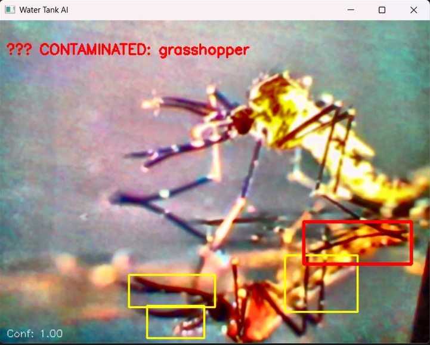
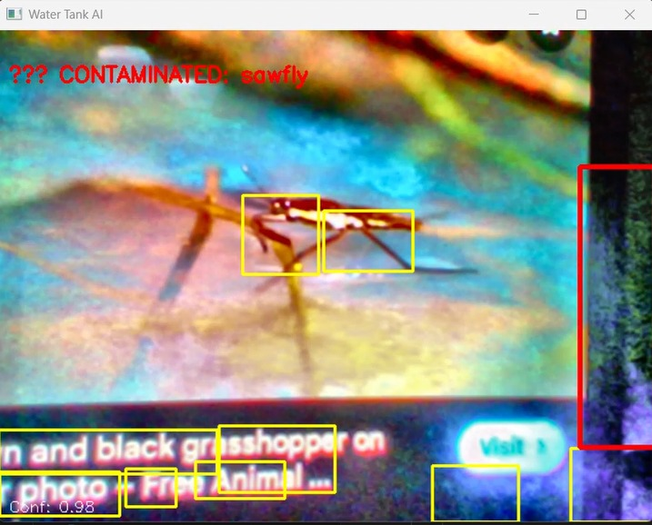
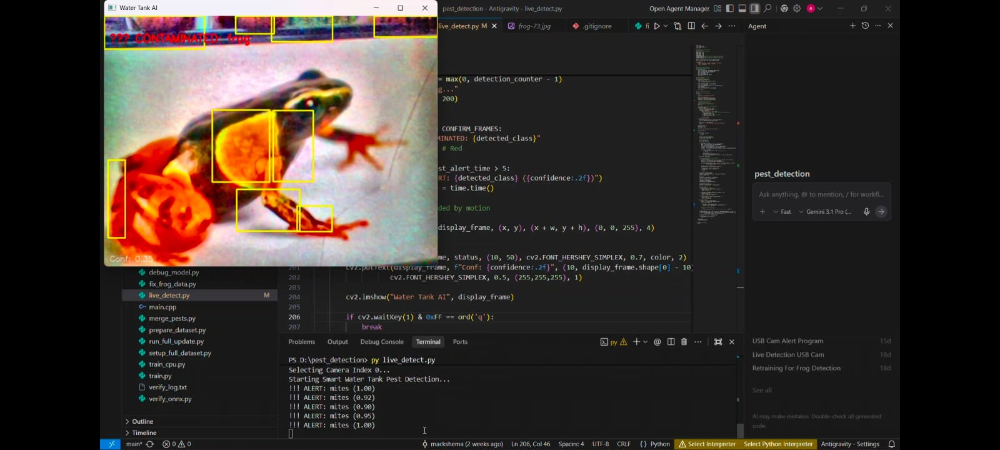

# Smart Water Tank Pest Detection System

## Overview

This project presents an embedded Artificial Intelligence system designed to monitor water tanks and detect biological contamination. The system uses an ESP32-CAM module for image acquisition and an AI model for detecting pests or contaminants in water tanks.

The goal of this project is to create a low-cost, scalable monitoring device capable of identifying contamination inside closed water storage systems such as household tanks, institutional tanks, and storage reservoirs.

The system performs visual inspection using computer vision and provides detection results through a local display interface.

---

## Problem Statement

Water tanks are rarely inspected internally, which can lead to contamination caused by insects, larvae, frogs, and suspended debris. Manual inspection is unsafe and inefficient because tanks are often sealed or located in inaccessible areas.

Current monitoring systems primarily measure water quality parameters but do not visually detect biological contamination.

This project addresses this gap by introducing an AI-based vision system capable of detecting pests and contaminants inside water tanks.

---

## System Objectives

- Detect biological contaminants using AI vision
- Provide real-time monitoring of water tank conditions
- Develop a compact embedded system using ESP32-CAM
- Design a scalable hardware architecture that supports future sensor integration
- Build a low-cost device suitable for residential and institutional use

---

## System Architecture

The system architecture consists of three main layers: image acquisition, AI processing, and output display.

```
Water Tank
   |
   v
ESP32-CAM Module
(Camera + WiFi + Microcontroller)
   |
   v
Image Preprocessing
   |
   v
AI Detection Model
   |
   v
Detection Result Processing
   |
   v
LCD Display Output
```

---

## Detection Pipeline

The AI detection pipeline processes captured images and identifies possible contaminants.

```
Camera Capture
      |
      v
Frame Preprocessing
      |
      v
Neural Network Inference
      |
      v
Confidence Evaluation
      |
      v
Temporal Validation
      |
      v
Final Detection Result
```

---

## Hardware Architecture

The hardware system integrates the ESP32-CAM module with supporting components to create a compact embedded device.

```
5V Power Adapter
        |
        v
Power Stabilization Circuit
(100uF + 0.1uF Capacitors)
        |
        v
ESP32-CAM Controller
        |
        v
I2C Interface
        |
        v
16x2 LCD Display
```

---

## Hardware Components

| Component | Quantity | Description |
|----------|----------|-------------|
| ESP32-CAM (AI Thinker) | 1 | Main microcontroller with camera module |
| 16x2 LCD with I2C | 1 | Displays system detection output |
| 5V 2A Adapter | 1 | Power supply for the system |
| Terminal Block 2-Pin | 1 | Power input connector |
| 100uF Electrolytic Capacitor | 1 | Power stabilization |
| 0.1uF Ceramic Capacitor | 1 | Noise filtering |
| Push Buttons | 2 | Boot and reset control |
| Pin Headers | 1 | PCB connectivity |
| Wiring and Miscellaneous | - | Signal routing |
| Custom PCB | 1 | Hardware integration platform |
| Plastic Enclosure | 1 | System housing |
| Screws and Standoffs | - | Mechanical mounting |

---

## PCB Design Considerations

The system uses a custom PCB to integrate all components into a compact device.

Design considerations include:

- Stable 5V power delivery
- Proper decoupling for ESP32-CAM
- Short analog signal traces
- Separation between power and signal routing
- Ground plane for noise reduction
- Adequate spacing around the ESP32 antenna

---

## Output Results

Below are example detection outputs from the system.

### Output Image 1


### Output Image 2


### Output Image 3


### Output Image 4


### Output Image 5


### Output Image 6


---

## Software Workflow

1. Capture image frames using ESP32-CAM  
2. Preprocess frames for AI inference  
3. Run detection model  
4. Evaluate prediction confidence  
5. Determine contamination status  
6. Display detection result  

---

## Future Improvements

The system architecture allows integration of additional water quality sensors.

Future modules may include:

- pH Sensor for chemical contamination detection
- Turbidity Sensor for suspended particle detection
- Temperature Sensor for environmental monitoring
- Ultrasonic Sensor for water level monitoring
- Cloud-based IoT monitoring dashboard

Future system architecture:

```
AI Vision Detection Layer
        |
Sensor Monitoring Layer
        |
IoT Communication Layer
        |
Remote Monitoring Dashboard
```

---

## Applications

- Household water tank monitoring
- Institutional water safety systems
- Smart building water management
- Public water infrastructure monitoring
- Environmental monitoring systems

---

## Project Structure

```
smart-water-ai/
|
|-- ai_model/
|   |-- training
|   |-- inference
|   |-- onnx_model
|
|-- firmware/
|   |-- esp32_camera_code
|
|-- hardware/
|   |-- pcb_design
|   |-- schematics
|
|-- dataset/
|   |-- pest_images
|   |-- annotations
|
|-- docs/
|   |-- project_report
```

---

## License

This project is released under the MIT License.

---

## Contributors

Embedded System Design  
AI Model Development  
Hardware Architecture Design  

---

## Vision

Develop an intelligent water monitoring platform that integrates artificial intelligence, embedded hardware, and environmental sensing to ensure safe and reliable water storage systems.
