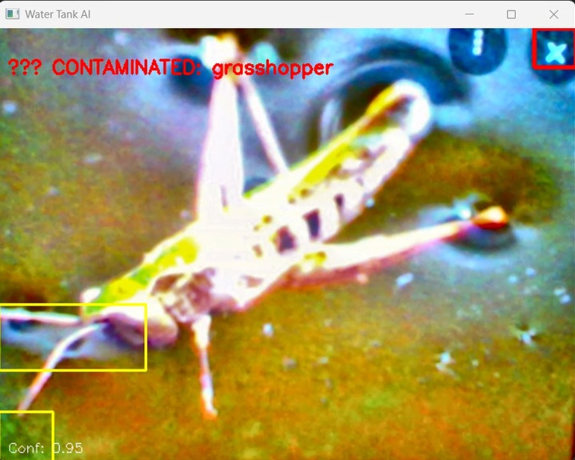
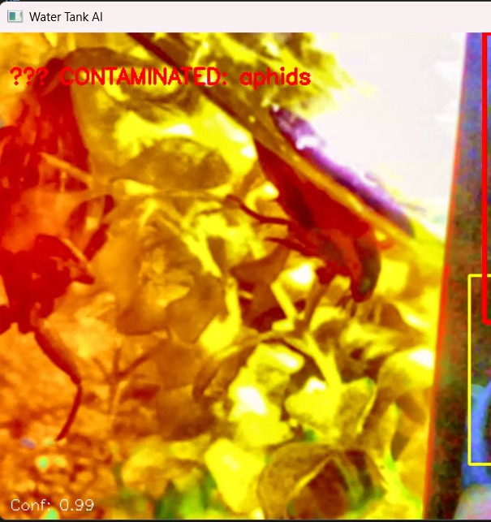
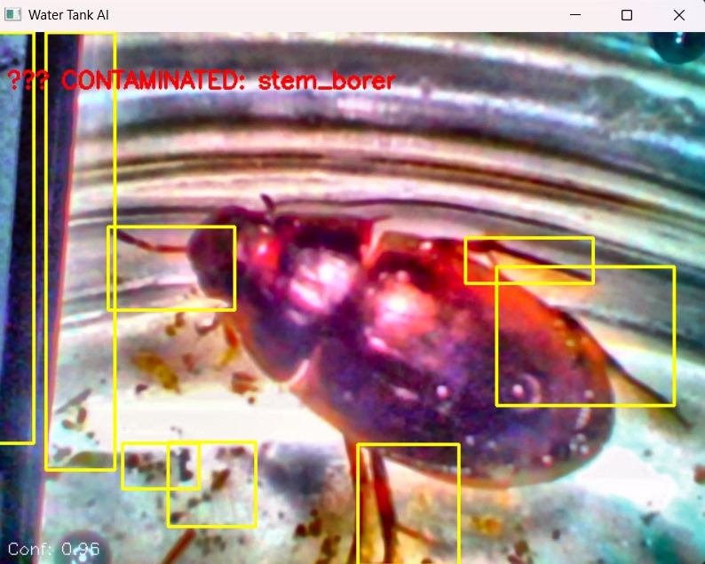

<div align="center">

#  Smart Water Tank Pest Detection System


<br/>

> ###  *An AI-powered embedded vision system that detects biological contamination inside water tanks — keeping your water safe, automatically.*

<br/>

```
💧  Capture  →  🧠  Detect  →  📟  Alert  →  ✅  Safe Water
```

</div>

---

##  Table of Contents

- [🌊 Overview](#-overview)
- [⚠️ Problem Statement](#️-problem-statement)
- [🎯 System Objectives](#-system-objectives)
- [🏗️ System Architecture](#️-system-architecture)
- [🔍 Detection Pipeline](#-detection-pipeline)
- [⚡ Hardware Architecture](#-hardware-architecture)
- [🔧 Hardware Components](#-hardware-components)
- [🖥️ PCB Design](#️-pcb-design-considerations)
- [📸 Output Results](#-output-results)
- [💻 Software Workflow](#-software-workflow)
- [🚀 Future Improvements](#-future-improvements)
- [🌍 Applications](#-applications)
- [📁 Project Structure](#-project-structure)
- [👥 Contributors](#-contributors)

---

##  Overview

The **Smart Water Tank Pest Detection System** is a low-cost, AI-powered embedded device designed to visually inspect water tanks for biological contamination — without any manual intervention.

Built around the **ESP32-CAM** module, the system captures real-time images of the tank interior, runs AI inference directly on the edge, and displays detection results on a compact LCD interface.

> ✅ No cloud required · ✅ Runs on embedded hardware · ✅ Real-time detection · ✅ Scalable architecture

---

##  Problem Statement

<table>
<tr>
<td>

🦟 **Insects & Larvae** lurk undetected in sealed tanks

🐸 **Frogs & debris** contaminate stored water silently

🔒 **Sealed/inaccessible** tanks make manual inspection unsafe

📊 **Existing systems** only measure chemical parameters — not biological threats

</td>
</tr>
</table>

This project addresses the critical gap by introducing a **computer vision-based AI system** that can detect pests and biological contaminants without opening or entering the tank.

---

##  System Objectives

| # | Objective |
|---|-----------|
| 🔎 | Detect biological contaminants using AI vision |
| ⏱️ | Provide real-time monitoring of water tank conditions |
| 📦 | Develop a compact embedded system using ESP32-CAM |
| 🔌 | Design a scalable hardware architecture for future sensor integration |
| 💰 | Build a low-cost device suitable for residential and institutional use |

---

##  System Architecture

```
┌─────────────────────────────────────┐
│           💧 Water Tank             │
└──────────────────┬──────────────────┘
                   │
                   ▼
┌─────────────────────────────────────┐
│       📷 ESP32-CAM Module           │
│   Camera + WiFi + Microcontroller   │
└──────────────────┬──────────────────┘
                   │
                   ▼
┌─────────────────────────────────────┐
│      🖼️ Image Preprocessing         │
└──────────────────┬──────────────────┘
                   │
                   ▼
┌─────────────────────────────────────┐
│      🧠 AI Detection Model          │
└──────────────────┬──────────────────┘
                   │
                   ▼
┌─────────────────────────────────────┐
│   📊 Detection Result Processing    │
└──────────────────┬──────────────────┘
                   │
                   ▼
┌─────────────────────────────────────┐
│       📟 LCD Display Output         │
└─────────────────────────────────────┘
```

---

##  Detection Pipeline

```
  📷 Camera Capture
         │
         ▼
  🖼️  Frame Preprocessing
         │
         ▼
  🤖  Neural Network Inference
         │
         ▼
  📈  Confidence Evaluation
         │
         ▼
  ⏳  Temporal Validation
         │
         ▼
  ✅  Final Detection Result
```

---

##  Hardware Architecture

```
  🔌 5V Power Adapter
         │
         ▼
  ⚡ Power Stabilization Circuit
     (100uF + 0.1uF Capacitors)
         │
         ▼
  🧠 ESP32-CAM Controller
         │
         ▼
  🔗 I2C Interface
         │
         ▼
  📟 16x2 LCD Display
```

---

## 🔧 Hardware Components

| Component | Qty | Description |
|-----------|:---:|-------------|
| 📷 ESP32-CAM (AI Thinker) | 1 | Main microcontroller with OV2640 camera module |
| 📟 16×2 LCD with I2C | 1 | Displays system status and detection output |
| 🔌 5V 2A Power Adapter | 1 | Primary power supply for the system |
| 🔲 Terminal Block 2-Pin | 1 | Power input connector |
| 🔵 100µF Electrolytic Capacitor | 1 | Power rail stabilization |
| ⚪ 0.1µF Ceramic Capacitor | 1 | High-frequency noise filtering |
| 🔘 Push Buttons | 2 | Boot and reset control |
| 📌 Pin Headers | 1 | PCB connectivity interface |
| 🔗 Wiring & Miscellaneous | — | Signal routing hardware |
| 🟩 Custom PCB | 1 | Integrated hardware platform |
| 🏠 Plastic Enclosure | 1 | Weatherproof system housing |
| 🔩 Screws & Standoffs | — | Mechanical mounting hardware |

---

## 🖥️ PCB Design Considerations

The system uses a **custom-designed PCB** to ensure reliability and compact form factor.

```
✔  Stable 5V power delivery
✔  Proper decoupling for ESP32-CAM
✔  Short analog signal traces
✔  Separation between power and signal routing
✔  Solid ground plane for noise reduction
✔  Adequate clearance around ESP32 WiFi antenna
```

---

## 📸 Output Results

Below are live detection outputs from the deployed system:

| Output | Output | Output |
|:------:|:------:|:------:|
|  |  |  |
| Detection Sample 1 | Detection Sample 2 | Detection Sample 3 |
|  |  |  |
| Detection Sample 4 | Live System Output | 🐸 Frog Detection |

---

## 💻 Software Workflow

```
Step 1  📷  Capture image frames via ESP32-CAM
          │
Step 2  🖼️  Preprocess frames for AI inference
          │
Step 3  🧠  Run detection model on edge hardware
          │
Step 4  📊  Evaluate prediction confidence score
          │
Step 5  🔍  Determine contamination status
          │
Step 6  📟  Display detection result on LCD
```

---

## 🚀 Future Improvements

The system is engineered for extensibility. Planned enhancements include:

| Sensor | Purpose |
|--------|---------|
| 🧪 pH Sensor | Chemical contamination detection |
| 🌊 Turbidity Sensor | Suspended particle monitoring |
| 🌡️ Temperature Sensor | Environmental condition tracking |
| 📡 Ultrasonic Sensor | Water level measurement |
| ☁️ IoT Dashboard | Remote cloud-based monitoring |

### 🔮 Future System Architecture

```
┌──────────────────────────────┐
│   🧠 AI Vision Detection      │
└──────────────┬───────────────┘
               │
┌──────────────▼───────────────┐
│   🌡️ Sensor Monitoring Layer  │
└──────────────┬───────────────┘
               │
┌──────────────▼───────────────┐
│   📡 IoT Communication Layer  │
└──────────────┬───────────────┘
               │
┌──────────────▼───────────────┐
│   📊 Remote Monitoring Dash   │
└──────────────────────────────┘
```

---

## 🌍 Applications

<div>

🏠 **Household** — Residential water tank monitoring  
🏫 **Institutional** — Schools, hospitals, offices  
🏢 **Smart Buildings** — Integrated water management  
🏙️ **Public Infrastructure** — City water systems  
🌿 **Environmental** — Wildlife and ecological monitoring  

</div>

---

## 📁 Project Structure

```
smart-water-ai/
│
├── 🧠 ai_model/
│   ├── training/
│   ├── inference/
│   └── onnx_model/
│
├── 💾 firmware/
│   └── esp32_camera_code/
│
├── ⚡ hardware/
│   ├── pcb_design/
│   └── schematics/
│
├── 🗄️ dataset/
│   ├── pest_images/
│   └── annotations/
│
└── 📄 docs/
    └── project_report/
```

---

## 👥 Contributors

<div align="center">

| Role | Contribution |
|------|-------------|
| 🔧 Embedded Systems Engineer | Hardware design & firmware development |
| 🧠 AI/ML Engineer | Model training, optimization & deployment |
| 🖥️ Hardware Architect | PCB design & system integration |

</div>

---

## 📜 License

```
MIT License — Free to use, modify, and distribute with attribution.
```

---

<div align="center">

## 💡 Vision

> *"Develop an intelligent water monitoring platform that integrates artificial intelligence,*
> *embedded hardware, and environmental sensing to ensure safe and reliable water storage systems."*

<br/>

**Built with ❤️ for safer water, smarter infrastructure.**

<br/>


</div>
